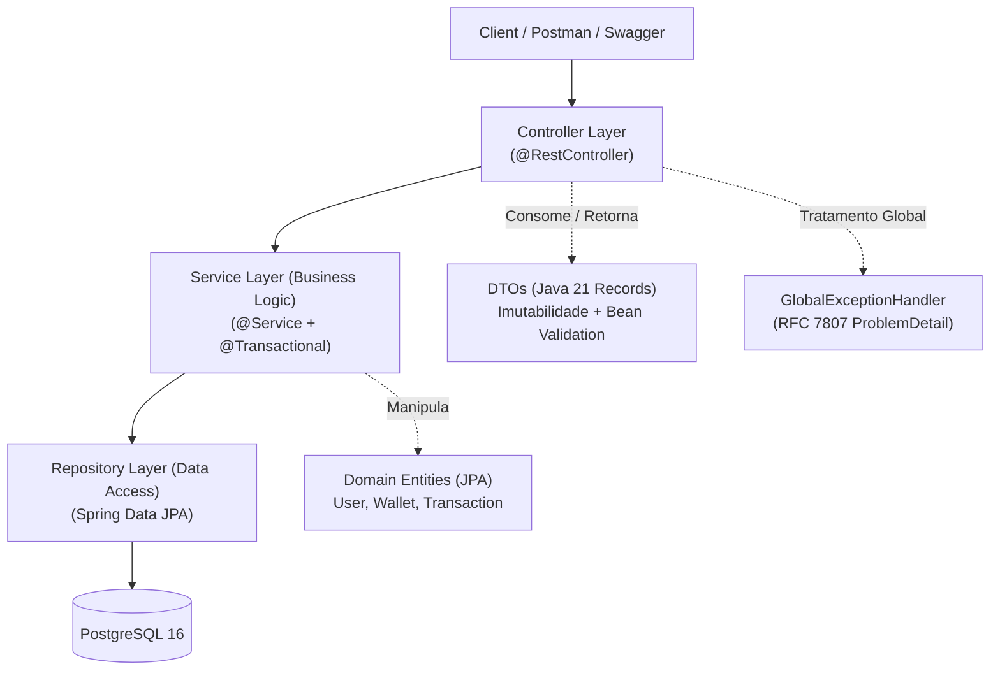
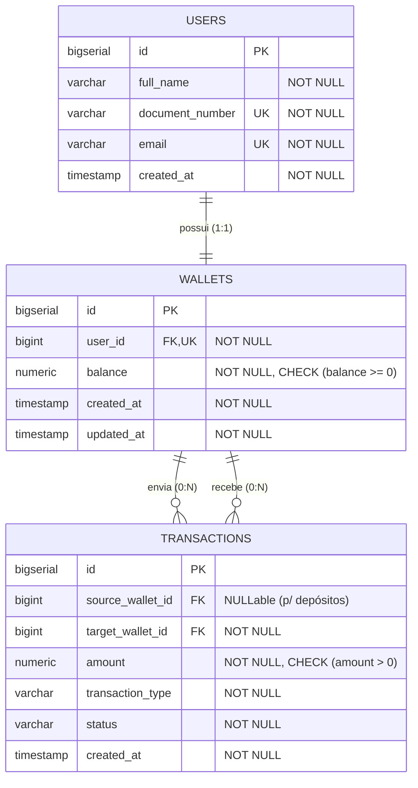

# 🏛️ PROJECT BLUEPRINT: Digital Wallet API (Carteira Digital & Transferências)

> **Documento de Especificação Arquitetural e Técnica**  
> **Perfil Alvo:** Desenvolvedor Java Júnior de Alto Nível (*High-Caliber Junior Backend Developer*)  
> **Objetivo:** Vitrine de Contratação (*Hiring Showcase*) para Aprovação em Triagens Técnicas e Entrevistas.

---

## 1. 🎯 Domínio e Escopo Funcional

### 1.1. Contexto do Problema
O **Digital Wallet API** é uma aplicação backend RESTful para gerenciamento de contas, custódia de saldo e transferências financeiras entre usuários. O projeto foi desenhado para demonstrar domínio impecável dos **fundamentos da engenharia de software corporativa**: Orientação a Objetos, Clean Code, integridade transacional, tratamento defensivo de erros e facilidade de manutenção.

Elimina-se intencionalmente a complexidade burocrática de sistemas distribuídos (ex: mensageria assíncrona, orquestração de microsserviços), focando no que realmente impressiona um Tech Lead em uma avaliação júnior: **clareza, robustez, código testável e segurança nas decisões arquiteturais**.

---

### 1.2. Regras de Negócio e Casos de Uso

1. **Gestão de Usuários e Carteiras:**
   - Cada usuário (`User`) possui dados cadastrais únicos (Nome, CPF/CNPJ e E-mail).
   - Ao cadastrar um usuário, uma carteira (`Wallet`) é criada automaticamente vinculada a ele com saldo inicial zerado (`0.00`).
   - O saldo (`balance`) utiliza o tipo `BigDecimal` com precisão de 2 casas decimais (`NUMERIC(19, 2)`), garantindo precisão financeira e demonstrando conhecimento do porquê **não** utilizar tipos primitivos de ponto flutuante (`float`/`double`).
   - Invariante de integridade: O saldo de uma carteira nunca pode ser negativo (`balance >= 0.00`).

2. **Operações Financeiras:**
   - **Depósito (*Deposit*):**
     - Permite adicionar fundos a uma carteira existente.
     - O valor deve ser obrigatoriamente positivo (`amount > 0.00`).
     - Gera um registro de transação com tipo `DEPOSIT` e status `COMPLETED`.
   - **Transferência Entre Carteiras (*P2P Transfer*):**
     - Movimentação atômica de valores entre duas carteiras distintas (origem e destino).
     - **Regras defensivas:**
       1. Carteiras de origem e destino devem existir e estar ativas.
       2. A carteira de origem não pode ser igual à carteira de destino (*Self-Transfer Check*).
       3. O valor da transferência deve ser estritamente positivo (`amount > 0.00`).
       4. A carteira de origem deve possuir saldo suficiente (`balance >= amount`).
     - A operação de débito e crédito é executada dentro de uma transação atômica gerenciada por `@Transactional`.
     - Gera um registro de transação com tipo `TRANSFER` e status `COMPLETED`.
   - **Consulta de Extrato (*Wallet Statement*):**
     - Consulta detalhada do saldo atual e da listagem histórica de transações (enviadas, recebidas e depósitos), ordenadas da mais recente para a mais antiga.

---

## 2. 🏗️ Arquitetura em Camadas e Estrutura de Pacotes

A aplicação adota a **Arquitetura em Camadas Tradicional (*Layered Architecture*)**, garantindo alta coesão e baixo acoplamento. 



### 2.1. Princípios Estruturais Aplicados
- **DTOs Imutáveis com Java 21 Records:** Desacoplamento 100% estrito entre as entidades JPA do banco de dados e os contratos da API pública (Requests/Responses). Nenhuma entidade JPA é exposta diretamente no Controller.
- **Validação Declarativa:** Anotações do Jakarta Bean Validation (`@NotNull`, `@Positive`, `@NotBlank`, `@Email`, `@CPF`) na camada de entrada dos Records.
- **Serviços Especializados:** Responsabilidade única (SRP) e métodos focados em regras de negócio claras.

---

### 2.2. Organização dos Diretórios (`src/main/java`)

```
src/main/java/com/portfolio/wallet
├── WalletApplication.java
│
├── controller
│   ├── UserController.java
│   ├── WalletController.java
│   └── TransferController.java
│
├── dto
│   ├── request
│   │   ├── CreateUserRequest.java       (Java Record + Bean Validation)
│   │   ├── DepositRequest.java          (Java Record + @Positive)
│   │   └── TransferRequest.java         (Java Record + @NotNull, @Positive)
│   └── response
│       ├── UserResponse.java            (Java Record)
│       ├── WalletResponse.java          (Java Record)
│       ├── TransferResponse.java        (Java Record)
│       ├── TransactionResponse.java     (Java Record)
│       └── StatementResponse.java       (Java Record)
│
├── service
│   ├── UserService.java                 (Interface)
│   ├── WalletService.java               (Interface)
│   ├── TransferService.java             (Interface)
│   └── impl
│       ├── UserServiceImpl.java
│       ├── WalletServiceImpl.java
│       └── TransferServiceImpl.java
│
├── repository
│   ├── UserRepository.java              (Spring Data JPA)
│   ├── WalletRepository.java            (Spring Data JPA)
│   └── TransactionRepository.java       (Spring Data JPA)
│
├── model
│   ├── User.java                        (@Entity)
│   ├── Wallet.java                      (@Entity)
│   ├── Transaction.java                 (@Entity)
│   └── enums
│       ├── TransactionType.java         (DEPOSIT, TRANSFER)
│       └── TransactionStatus.java       (COMPLETED, FAILED)
│
├── exception
│   ├── BusinessException.java           (Exceção base não-checada)
│   ├── InsufficientBalanceException.java
│   ├── WalletNotFoundException.java
│   ├── UserNotFoundException.java
│   ├── DocumentAlreadyExistsException.java
│   ├── EmailAlreadyExistsException.java
│   ├── SameWalletTransferException.java
│   └── GlobalExceptionHandler.java      (@RestControllerAdvice + RFC 7807)
│
└── config
    └── OpenApiConfig.java               (Configuração Springdoc Swagger UI)
```

---

## 3. 🗄️ Modelagem de Dados & Flyway Migrations

### 3.1. Diagrama Entidade-Relacionamento (ERD)



---

### 3.2. Scripts de Migração Flyway (`src/main/resources/db/migration`)

As migrações são versionadas e garantem integridade referencial e validações a nível de banco:

1. **`V1__create_users_table.sql`**
   - Criação da tabela `users` com chaves únicas para `document_number` e `email`.
   - Índices para buscas rápidas por documento e e-mail.

2. **`V2__create_wallets_table.sql`**
   - Criação da tabela `wallets` com relacionamento 1:1 único com `users`.
   - **Garantia de consistência de saldo:** `CONSTRAINT chk_wallet_balance_positive CHECK (balance >= 0.00)`.

3. **`V3__create_transactions_table.sql`**
   - Criação da tabela `transactions`.
   - Chaves estrangeiras referenciando `wallets(id)`.
   - `CONSTRAINT chk_transaction_amount_positive CHECK (amount > 0.00)`.
   - Invariante de integridade: em transferências, carteira de origem e destino não podem ser iguais.

4. **`V4__create_indexes.sql`**
   - Índices para otimização de consultas de extrato por carteira e ordenação temporal:
     - `CREATE INDEX idx_transactions_target_created ON transactions (target_wallet_id, created_at DESC);`
     - `CREATE INDEX idx_transactions_source_created ON transactions (source_wallet_id, created_at DESC);`

---

## 4. 🛡️ Estratégia de Validação e Exceções (RFC 7807)

### 4.1. Validações Defensivas de Entrada (Bean Validation)
Antes de atingir qualquer lógica de negócio, os parâmetros de entrada são rigorosamente validados:
- `@NotBlank(message = "O nome é obrigatório")`
- `@Email(message = "Formato de e-mail inválido")`
- `@NotNull(message = "O valor da operação é obrigatório")`
- `@Positive(message = "O valor deve ser maior que zero")`

### 4.2. Mapeamento de Exceções de Domínio e Status HTTP

| Exceção | Gatilho de Negócio | HTTP Status | RFC 7807 Code |
| :--- | :--- | :--- | :--- |
| `InsufficientBalanceException` | Saldo insuficiente para transferência | `422 Unprocessable Entity` | `INSUFFICIENT_FUNDS` |
| `WalletNotFoundException` | Carteira de origem ou destino não encontrada | `404 Not Found` | `WALLET_NOT_FOUND` |
| `UserNotFoundException` | Usuário consultado não encontrado | `404 Not Found` | `USER_NOT_FOUND` |
| `SameWalletTransferException` | Origem e destino da transferência são a mesma carteira | `400 Bad Request` | `SELF_TRANSFER_FORBIDDEN` |
| `DocumentAlreadyExistsException` | Tentativa de cadastrar CPF/CNPJ já existente | `409 Conflict` | `DOCUMENT_ALREADY_EXISTS` |
| `EmailAlreadyExistsException` | Tentativa de cadastrar e-mail já existente | `409 Conflict` | `EMAIL_ALREADY_EXISTS` |
| `MethodArgumentNotValidException` | Falha de validação nos campos do Record (@Valid) | `400 Bad Request` | `INVALID_INPUT_PARAMETERS` |

### 4.3. Exemplo de Resposta de Erro Padronizada (RFC 7807 Problem Details)
Todas as exceções são capturadas pelo `@RestControllerAdvice` e convertidas no padrão RFC 7807 com a classe nativa do Spring Boot 3 `ProblemDetail`:

```json
{
  "type": "https://api.wallet.com/errors/insufficient-balance",
  "title": "Saldo Insuficiente",
  "status": 422,
  "detail": "A carteira de ID 1 possui saldo de R$ 50.00, mas a transferência requer R$ 80.00.",
  "instance": "/api/v1/transfers",
  "timestamp": "2026-09-07T22:15:00Z"
}
```

---

## 5. 🧪 Plano de Testes Unitários (JUnit 5 + Mockito + AssertJ)

A camada de testes unitários foca onde o valor de negócio reside: **nas regras e validações da camada de Service**. Os testes são estruturados seguindo o padrão **Given / When / Then** (ou Arrange / Act / Assert).

### 5.1. Matriz de Cobertura da Camada de Serviço

#### 🔹 `TransferServiceTest` (O coração da aplicação)
- **Cenário 1 (Caminho Feliz):** Transferência realizada com sucesso entre duas carteiras válidas com saldo.
  - *Asserções:* Saldo da origem subtraído; saldo do destino incrementado; `transactionRepository.save()` invocado; valores retornados no DTO corretos.
- **Cenário 2 (Falha - Saldo Insuficiente):** Carteira de origem não possui saldo suficiente.
  - *Asserções:* Lança `InsufficientBalanceException`; nenhum saldo alterado; `transactionRepository.save()` nunca invocado (`verify(..., never())`).
- **Cenário 3 (Falha - Carteira Origem Inexistente):** ID de origem não encontrado no repositório.
  - *Asserções:* Lança `WalletNotFoundException`.
- **Cenário 4 (Falha - Carteira Destino Inexistente):** ID de destino não encontrado no repositório.
  - *Asserções:* Lança `WalletNotFoundException`.
- **Cenário 5 (Falha - Auto-Transferência):** Origem e destino com o mesmo identificador de carteira.
  - *Asserções:* Lança `SameWalletTransferException`; nenhuma chamada ao banco realizada.

#### 🔹 `WalletServiceTest`
- **Cenário 1 (Caminho Feliz):** Depósito realizado com sucesso em carteira ativa.
  - *Asserções:* Saldo incrementado corretamente; registro de transação com tipo `DEPOSIT` persistido.
- **Cenário 2 (Falha - Carteira Inexistente):** Tentativa de depósito em carteira não cadastrada.
  - *Asserções:* Lança `WalletNotFoundException`.
- **Cenário 3 (Caminho Feliz):** Consulta de extrato retorna saldo atual e lista histórica de transações mapeadas para Records.

#### 🔹 `UserServiceTest`
- **Cenário 1 (Caminho Feliz):** Cadastro de usuário com dados válidos e criação automática de carteira associada.
- **Cenário 2 (Falha - Documento Duplicado):** Tentativa de cadastro com CPF/CNPJ já cadastrado lança `DocumentAlreadyExistsException`.
- **Cenário 3 (Falha - E-mail Duplicado):** Tentativa de cadastro com e-mail já cadastrado lança `EmailAlreadyExistsException`.

---

## 6. 🐳 DevOps e Execução Fácil para o Avaliador

### 6.1. Execução do Banco de Dados via Docker Compose
O avaliador não precisa instalar ou configurar o PostgreSQL manualmente em sua máquina. O arquivo `docker-compose.yml` na raiz sobe o banco de dados pronto para conexão:

```bash
docker compose up -d
```

### 6.2. Execução da Aplicação via Maven Wrapper
Graças ao Maven Wrapper incluso no projeto (`mvnw` e `mvnw.cmd`), o projeto roda sem necessidade de Maven pré-instalado:

```bash
# Executar a aplicação
./mvnw spring-boot:run

# Rodar todos os testes unitários
./mvnw clean test
```

### 6.3. Documentação Interativa OpenAPI
Após a inicialização, a documentação e os endpoints estão disponíveis imediatamente no navegador através da interface Swagger UI:
- **URL do Swagger:** `http://localhost:8080/swagger-ui/index.html`

---

## 7. 📋 Cronograma de Milestones (Marcos de Desenvolvimento)

O desenvolvimento será executado de forma sequencial e incremental, com aprovação a cada marco:

- [x] **Milestone 1: Fundação do Projeto & Infraestrutura Local**
  - Configuração do `pom.xml` (Java 21, Spring Boot 3.3.x, Spring Data JPA, Flyway, PostgreSQL, Validation, Springdoc OpenAPI).
  - Geração dos arquivos do Maven Wrapper (`mvnw`, `mvnw.cmd`, `.mvn/wrapper`).
  - Criação do `docker-compose.yml` para o PostgreSQL 16.
  - Criação do `application.yml` configurando datasource, JPA e Flyway.

- [x] **Milestone 2: Migrations Flyway & Estrutura Relacional**
  - Criação dos scripts SQL (`V1` a `V4`) em `src/main/resources/db/migration`.
  - Validação da execução das migrações e constraints no banco.

- [x] **Milestone 3: Camada de Domínio (Entities & Enums) e Repositories**
  - Implementação das entidades JPA (`User`, `Wallet`, `Transaction`).
  - Implementação dos enums de domínio (`TransactionType`, `TransactionStatus`).
  - Criação dos repositories Spring Data JPA com métodos de busca customizados.

- [x] **Milestone 4: DTOs (Records), Exceções de Domínio & RFC 7807**
  - Implementação dos Java Records de entrada (Requests) e saída (Responses).
  - Criação da hierarquia de exceções de negócio personalizadas.
  - Implementação do `GlobalExceptionHandler` utilizando `ProblemDetail`.

- [x] **Milestone 5: Camada de Serviços (Service Layer) & Regras de Negócio**
  - Implementação de `UserService`, `WalletService` e `TransferService`.
  - Configuração de transacionalidade `@Transactional` nas operações de débito e crédito.
  - Validações de consistência de saldo e invariantes.

- [x] **Milestone 6: Suíte de Testes Unitários (JUnit 5 + Mockito + AssertJ)**
  - Implementação de `TransferServiceTest` cobrindo caminho feliz e os 4 cenários de falha.
  - Implementação de `WalletServiceTest` e `UserServiceTest`.
  - Verificação de 100% de aprovação na suíte de testes unitários.

- [x] **Milestone 7: Camada de Apresentação (Controllers) & Swagger UI**
  - Criação de `UserController`, `WalletController` e `TransferController`.
  - Aplicação de `@Valid` nos endpoints REST.
  - Configuração da documentação OpenAPI/Swagger com anotações explicativas.

- [x] **Milestone 8: README.md de Alta Conversão para Recrutadores**
  - Apresentação visual da arquitetura e das decisões técnicas.
  - Justificativa do uso de `BigDecimal`, `Java Records`, `@Transactional` e RFC 7807.
  - Passo a passo de execução rápida (`docker compose up -d` e `./mvnw spring-boot:run`).
  - Exemplos de requisição cURL para teste imediato.
