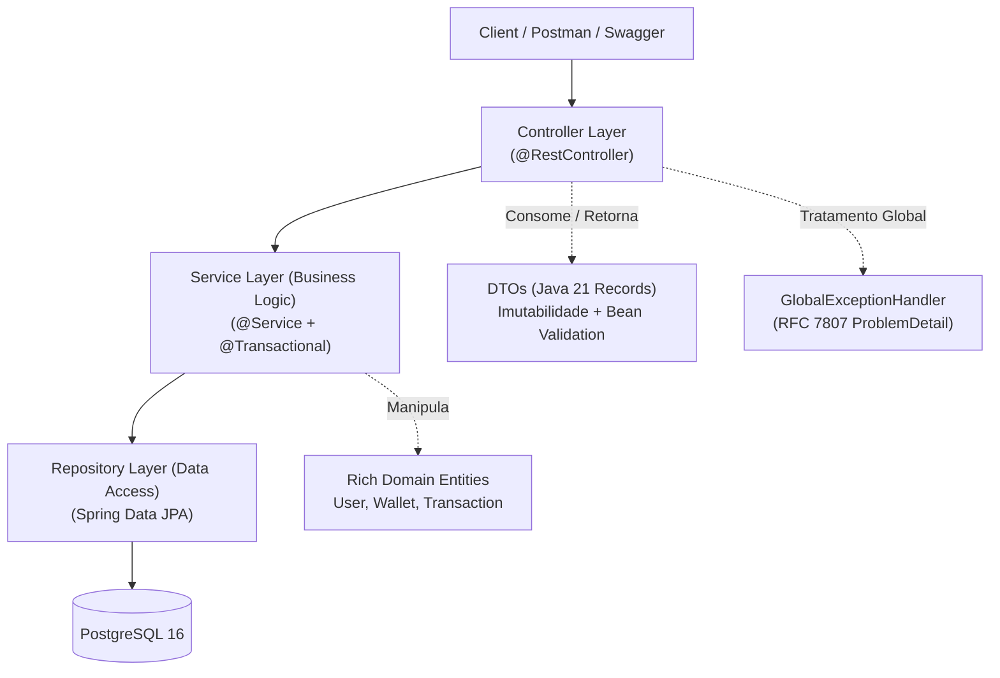

# 🏛️ Digital Wallet & Transfers API (Carteira Digital & Transferências P2P)

[](https://openjdk.org/projects/jdk/21/)
[](https://spring.io/projects/spring-boot)
[](https://www.postgresql.org/)
[](https://flywaydb.org/)
[](https://www.docker.com/)
[](http://localhost:8080/swagger-ui/index.html)
[](https://junit.org/junit5/)

> **Projeto Showcase de Engenharia Backend Corporativa**  
> Desenvolvido para demonstrar domínio prático dos fundamentos da engenharia de software corporativa: **Orientação a Objetos, Clean Code, integridade transacional (ACID), concorrência segura com controle de deadlocks e tratamento defensivo de erros padronizado (RFC 7807)**.

---

## 🧭 Sumário Executivo

O **Digital Wallet API** é um serviço backend RESTful para gerenciamento de contas, custódia de saldo monetário e transferências ponto a ponto (P2P) entre carteiras.

O sistema foi arquitetado deliberadamente para priorizar **clareza, robustez, tolerância a falhas e segurança em concorrência**, espelhando as exigências de sistemas bancários e fintechs de alta criticidade.

---

## 🏗️ Arquitetura do Sistema

A aplicação adota a **Arquitetura em Camadas Tradicional (*Layered Architecture*)** com desacoplamento estrito entre contratos de API (DTOs) e persistência relacional (JPA Entities):



---

## 💎 Decisões Técnicas de Alto Nível (*Engineering Highlights*)

### 1. Precisão Financeira Estrita com `BigDecimal` (`NUMERIC(19, 2)`)
- **Problema:** O uso de tipos de ponto flutuante binário primitivos (`float`/`double`) acarreta imprecisões de arredondamento IEEE 754 (ex: `0.1 + 0.2 = 0.30000000000000004`), o que é inaceitável em contextos financeiros.
- **Solução:** Todos os saldos e montantes de transação utilizam `BigDecimal` no Java com escala fixa de 2 casas decimais e arredondamento financeiro bancário `RoundingMode.HALF_UP`, mapeados para colunas `NUMERIC(19, 2)` no PostgreSQL.

### 2. Prevenção de Condições de Corrida e Deadlocks em Transferências Concorrentes
- **Problema:** Se o Usuário A transfere para o Usuário B no mesmo milissegundo em que B transfere para A, o bloqueio ingênuo de linhas no banco causa **Deadlock Mútuo** ou **Lost Updates** de saldo.
- **Solução:** O `TransferServiceImpl` adquire bloqueios de escrita pessimistas (`SELECT ... FOR UPDATE` via `@Lock(LockModeType.PESSIMISTIC_WRITE)`) seguindo uma **ordenação determinística de IDs**:
  ```java
  Long firstLockId = Math.min(sourceId, targetId);
  Long secondLockId = Math.max(sourceId, targetId);
  ```
  Isso garante que todas as transações concorrentes sempre travem os recursos na mesma ordem numérica, **eliminando matematicamente o risco de deadlocks**.

### 3. Rich Domain Model (Modelo de Domínio Rico)
- As entidades de domínio não são meros objetos anêmicos cheios de *getters* e *setters*. A entidade `Wallet` encapsula suas próprias regras e invariantes de saldo:
  - `wallet.deposit(amount)`
  - `wallet.withdraw(amount)`
  - `wallet.hasSufficientBalance(amount)`

### 4. Defesa em Camadas & Invariantes no Banco de Dados (Flyway Migrations)
- Mesmo que uma camada de aplicação falhasse, o banco de dados PostgreSQL rejeitaria dados inválidos através de constraints DDL:
  - `CONSTRAINT chk_wallet_balance_non_negative CHECK (balance >= 0.00)`
  - `CONSTRAINT chk_transaction_amount_positive CHECK (amount > 0.00)`
  - `CONSTRAINT chk_transaction_different_wallets CHECK (source_wallet_id IS NULL OR source_wallet_id <> target_wallet_id)`
  - `ON DELETE RESTRICT` em foreign keys monetárias para impedir perda acidental de histórico.

### 5. Tratamento de Erros Padronizado sob RFC 7807 (`ProblemDetail`)
- Todas as exceções da aplicação são interceptadas por um `@RestControllerAdvice` e convertidas no padrão nativo do Spring Boot 3 `org.springframework.http.ProblemDetail`, devolvendo `application/problem+json` com códigos HTTP precisos (`422`, `404`, `400`, `409`) e metadados contextuais (timestamp, invalid params, URLs de especificação).

---

## 🚀 Como Executar o Projeto

### Pré-requisitos
- **Java 21 LTS**
- **Docker Desktop** (com Docker Compose ativo)

> **Nota:** Não é necessário ter o Maven instalado globalmente na máquina. O projeto inclui os scripts do Maven Wrapper (`mvnw` e `mvnw.cmd`).

---

### Opção A: Executar Tudo via Docker Compose (Recomendado / 1 Comando)
Para subir o banco de dados PostgreSQL e a API containerizada juntos com apenas um comando:
```bash
docker compose up --build -d
```
*A imagem Docker multi-stage é compilada e otimizada automaticamente com Alpine Linux + Eclipse Temurin 21 JRE, o banco é inicializado e a API aguarda o healthcheck do PostgreSQL antes de iniciar na porta `8080`.*

---

### Opção B: Executar Localmente via Maven Wrapper ou JAR

#### 1. Subir apenas o Banco de Dados (PostgreSQL 16)
```bash
docker compose up postgres -d
```

#### 2. Executar a Aplicação (via Maven Wrapper ou Fat JAR)

**Via Maven Wrapper:**
```powershell
# Windows
.\mvnw.cmd spring-boot:run

# Linux / macOS
./mvnw spring-boot:run
```

**Via Fat JAR compilado:**
```bash
# Build do JAR executável
.\mvnw.cmd clean package

# Execução direta
java -jar target/wallet-0.0.1-SNAPSHOT.jar
```

*O Flyway executará automaticamente as migrações `V1` a `V4` ao inicializar e o Hibernate validará a integridade do schema.*

---

### Passo 3: Executar a Suíte Completa de Testes
```bash
.\mvnw.cmd clean test
```
*Executa todos os **66 testes automatizados** (unitários, mocks com Mockito, slices JPA, migrations e controladores com MockMvc).*

---

## 📖 Documentação Interativa (Swagger UI)

Com a aplicação rodando, acesse a documentação interativa e execute chamadas diretamente pelo navegador:

👉 **URL do Swagger UI:** [http://localhost:8080/swagger-ui/index.html](http://localhost:8080/swagger-ui/index.html)  
👉 **Especificação OpenAPI JSON:** [http://localhost:8080/v3/api-docs](http://localhost:8080/v3/api-docs)

---

## 🧪 Exemplos de Requisições cURL para Teste Imediato

### 1. Cadastrar Usuário A (Criador da Carteira 1)
```bash
curl -X POST http://localhost:8080/api/v1/users \
  -H "Content-Type: application/json" \
  -d '{
    "fullName": "Ada Lovelace",
    "documentNumber": "12345678901",
    "email": "ada@lovelace.org"
  }'
```

### 2. Cadastrar Usuário B (Criador da Carteira 2)
```bash
curl -X POST http://localhost:8080/api/v1/users \
  -H "Content-Type: application/json" \
  -d '{
    "fullName": "Alan Turing",
    "documentNumber": "98765432100",
    "email": "alan@turing.org"
  }'
```

### 3. Realizar Depósito na Carteira 1 (R$ 250,00)
```bash
curl -X POST http://localhost:8080/api/v1/wallets/1/deposit \
  -H "Content-Type: application/json" \
  -d '{
    "amount": 250.00
  }'
```

### 4. Realizar Transferência P2P da Carteira 1 para a Carteira 2 (R$ 80,00)
```bash
curl -X POST http://localhost:8080/api/v1/transfers \
  -H "Content-Type: application/json" \
  -d '{
    "sourceWalletId": 1,
    "targetWalletId": 2,
    "amount": 80.00
  }'
```

### 5. Consultar Extrato da Carteira 1 (Histórico Ordenado)
```bash
curl -X GET http://localhost:8080/api/v1/wallets/1/statement
```

### 6. Testar Tratamento Defensivo: Transferência com Saldo Insuficiente (RFC 7807)
```bash
curl -X POST http://localhost:8080/api/v1/transfers \
  -H "Content-Type: application/json" \
  -d '{
    "sourceWalletId": 1,
    "targetWalletId": 2,
    "amount": 5000.00
  }'
```
**Resposta (HTTP 422 Unprocessable Entity):**
```json
{
  "type": "https://api.wallet.com/errors/insufficient-funds",
  "title": "Saldo Insuficiente",
  "status": 422,
  "detail": "A carteira de ID 1 possui saldo de R$ 170.00, mas a operação requer R$ 5000.00.",
  "instance": "/api/v1/transfers",
  "code": "INSUFFICIENT_FUNDS",
  "walletId": 1,
  "currentBalance": 170.00,
  "requiredAmount": 5000.00,
  "timestamp": "2026-09-09T10:45:00Z"
}
```

---

## 📊 Matriz de Cobertura e Testes Automatizados (66 Testes)

| Camada | Classe de Teste | Quantidade | Foco da Validação |
| :--- | :--- | :---: | :--- |
| **Banco de Dados** | `FlywayMigrationTest` | 1 | Validação do schema SQL V1..V4 no H2 |
| **Banco de Dados** | `PostgresFlywayIntegrationTest` | 1 | Validação de migração real no PostgreSQL 16 |
| **Persistência** | `UserRepositoryTest` | 5 | Buscas, checagens de duplicidade e constraints únicas |
| **Persistência** | `WalletRepositoryTest` | 5 | Pessimistic Locking (`findByIdWithLock`), `deposit`, `withdraw` |
| **Persistência** | `TransactionRepositoryTest` | 3 | Gravação de depósitos/transferências e ordenação temporal de extrato |
| **Regras de Negócio** | `TransferServiceTest` | 6 | Caminho feliz e 5 cenários defensivos de falha |
| **Regras de Negócio** | `WalletServiceTest` | 5 | Depósitos com locking, consultas e montagem de extrato |
| **Regras de Negócio** | `UserServiceTest` | 6 | Criação com carteira vinculada e duplicidades |
| **Validação / DTOs** | `DtoValidationTest` | 9 | Validações declarativas do Bean Validation em Records |
| **Exceções RFC 7807** | `GlobalExceptionHandlerTest` | 7 | Mapeamento de ProblemDetail e status HTTP corretos |
| **Controladores REST**| `UserControllerTest` | 6 | MockMvc: rotas `/api/v1/users`, status 201, 400, 404, 409 |
| **Controladores REST**| `WalletControllerTest` | 6 | MockMvc: rotas `/api/v1/wallets`, depósitos e extratos |
| **Controladores REST**| `TransferControllerTest`| 5 | MockMvc: rotas `/api/v1/transfers`, 200, 400, 404, 422 |
| **Contexto** | `WalletApplicationTests` | 1 | Carregamento limpo do contexto Spring Boot |
| **TOTAL** | | **66 Testes** | **100% de Aprovação (0 Falhas)** |

---

## 👨‍💻 Autor

- **Desenvolvido por:** [Welinton Thiago](https://github.com/wthiagosan)
- **E-mail:** [W.thiagosan@gmail.com](mailto:W.thiagosan@gmail.com)
- **Repositório:** [https://github.com/wthiagosan/digital-wallet-api](https://github.com/wthiagosan/digital-wallet-api)
- **Perfil:** Desenvolvedor Java Backend
- **Objetivo:** Showcase técnico de engenharia de software para contratação de alto nível.
